<!-- TOC tocDepth:2..3 chapterDepth:2..6 

- [A Brief Anatomy Of A UniteServer Application](#a-brief-anatomy-of-a-uniteserver-application)
  - [Overview and start up sequence](#overview-and-start-up-sequence)
  - [Design Principals](#design-principals)
  - [IUnite Message](#iunite-message)
  - [Connectors:](#connectors)
  - [Endpoints](#endpoints)
  - [Pipes and strategies](#pipes-and-strategies)
  - [Specialisations (Derivatives)](#specialisations-derivatives)
    - [Pipe Specialisation](#pipe-specialisation)
    - [Process Specialisations](#process-specialisations)
    - [Process Specialisations With Implementation Injection](#process-specialisations-with-implementation-injection)
  - [Code stack, replacements, defaults and pitfalls](#code-stack-replacements-defaults-and-pitfalls)
    - [Code stack](#code-stack)
    - [Replacements \& defaults](#replacements--defaults)
    - [Pitfalls](#pitfalls)

<!-- /TOC -->

# A Brief Anatomy Of A UniteServer Application / Service

Unite server is development platform which basically converts a set of YAML files, resource files and .Net core code into into a working Function App or containerised app.  It is the aim of this document to give a brief overview of each of the constituent parts, data structures and message flows.

## Architecture:

A Unite Server Application is a modified Microsoft .Net core application. This application, rather than being built from a standard set of, say C# files, is built by combining different types of text and assembly files into a single zip file that can be run as either an Azure Function App or containerised app.

The files that make up a Unite Server App are: 

* The Variant runtime. 
* Extension packages:  
* Configuration files
* YAML code files
* Reference files

When an application is deployed or a release created, The Unite development platform combines each of these files into a single deployable .Net Core runtime zip file. 

### The Runtime

The runtime is a versionable set of core files which each application is deployed with to create a runnable application.  Unite currently offers 2 different runtimes that an application can hosted in: An Azure Function App or a containerised app. Each of these 'hosting' options provide the following features:

* Http endpoint capabilities
* Background hosting services
* Logging & instrumentation
* Configuration and substitution management
* Inline code compilation
* Base connectors and pipes classes for building additional assembly based extension packages.


### Extension packages

Extension Packages are discreet library components that are imported into an application to add different types of functionality to the core runtime. This functionality can include:
* A prebuilt set of YAMLised connectors, pipes & strategies that can be configured directly in the application. Examples of these include libraries for Azure Management, Libraries that connect directly
* The ability to extend the platform through new .Net Core code. This code, based from classes found in the Unite framework assemblies,  would be uploaded to the platform and the platform would create the necessary Yaml metadata files to allow the functionality to be called the YAML code files directly.
* New substitution methods that are run in the subsitution service.
* The ability to quickly share code snippets between projects promoting the reuse of code artifacts at any granular level.

### Configuration files

There are 4 different configuration files used in a Unite service:

* **appsetings.json**: As it's name sugguests, this is a configuration file and of the same format and schema as a standard .Net core settings file.
* **local.settings.json**: This is a settings file which is only used when developing the application. It is not included in any release zip file.
* **site-config.json**:  this is a project file and keeps track of any extension packages added as well as other deployment information. in general, you should not need to edit this file manually. 
* **service.yaml**: This file contains the configuration of any startup services the application needs. These include, but are not limited to: any external application settings configuration stores that are needed, as well as Uniite development services that are required for the development environment. 

### YAML code files

Unite applications work on the idea of a message that is processed through a series of pipes i.e. a pipeline. That message is created by a certain event or timer and that message then flows down the pipes being processed and updated by each pipe as and when required.  Unite determines where these messages come from and configured through 4 different types of objects:
* Connectors
* Endpoints
* Pipes
* Strategies

#### Connectors

An application can contain multiple inbound connectors. and these fall into 2 categories:

- **Listeners**: Waits for to external systems to contact it. Implementation examples include: an HTTP endpoints,, Service bus listeners an endpoint connected to Twitter or a web sockets.
- **Timers**: Interval or schedule timers can be connected to intents that pull a single message or multiple messages and then process those items or just fire off an instruction to start off another type of process. Example of these include reading a database for a list of users to perform some action on each or polling a queue for messages

Below are examples of 2 connectors that are found in the default service StartUp page.

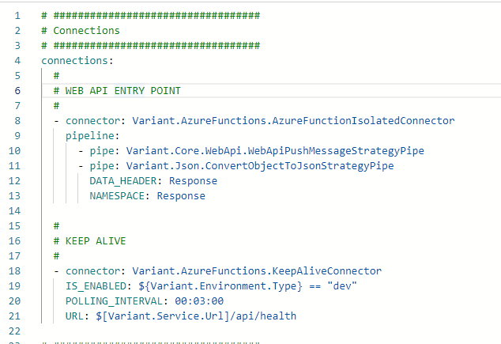

The **AzureFunctionIsolatedConnector** is the primary API endpoint connector for managing API calls using functionsApps. All API calls go through this connector and are routed on the their specific API endpoint.

The second **KeepAliveConnector** is a function app only connector and is used to stop any function apps hosted in a consumption plan from shutting down


#### Endpoints

Endpoints are routed HTTP connections. That the runtime calls via the AzureFunctionIsolatedConnector , when it's an Azure Function App or the API KestrelConnector when creating containerized apps. These lisiteners are configured differently to normal connectors but they have the same pipeline property that works the same as the connectors pipeline:

An endpoint can also describe the request, queries, headers and response properties as seen above. These allow for both the OpenApi specification to be generated adn inputs validated. An example of this is seen below:

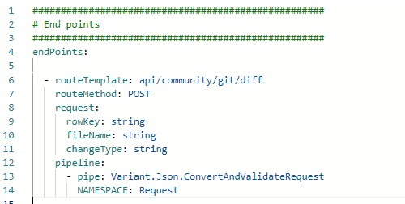

#### Pipes and strategies

Pipes are placed in a pipeline and perform actions based on their intent. In the core framework there are multiple intent pipes each with multiple strategies (implementations). Examples of the types of intents are

- PushMessage: Pushes data to somewhere. Strategies include: HTTP call, file writer, databases upserts, Azure storage, etc.

- PullMessagesPipe: pulls a list of messages from a somewhere. Strategies available include :database, file directory, Azure Storage etc.

- ForEachMessagePipe: This uses PullMessage implementations and allows the iteration of messages pulled from the specified strategies.

- PullSingleMessagePipe: As above but only deals with a single message

- ModifyMessagePipe: This can be used to update the UniteMessage. Examples include encryption and decryption, compression, converting a message to and from a JSON string, adding new values values.
- AggregatePipe: Helpful when aggregating data. Examples include: StringBuilderAggregate, JArrayAggregate.

If we look at 2 examples of the PushMessagePipe we see that the implementation is denoted in the strategy property:

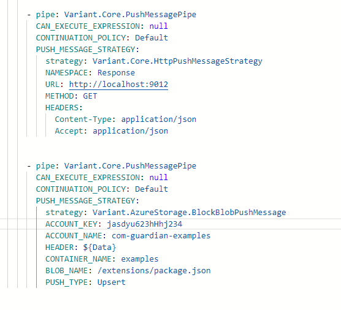

This notation can be a bit long winded so when strategies are imported from .Net assemblies the importer creates a specialised version of each strategy that includes the the strategy name in the pipe. This allows the developer to use this simplified version and reduce the number of lines of code. Examples of the are:

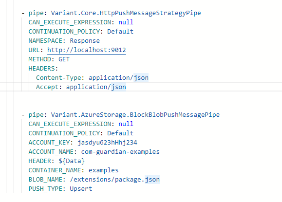

The above pipes also include default values. If we are ok with the default values then we can remove them so the code would now look like:

N.B. The actual pipes and strategies have many more default values however, for brevity, these have been removed.

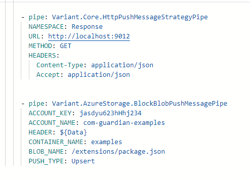

The above examples where each pipe name contains the strategy name are examples of specialisations. Specialisations are critical when developing applications and provide a multitude of benefits.


### Strategies
Unite applications are built using an intent first coding principal. This is analogous to interfaces in classes found in programming languages such as Java & c#. Strategies, in this context, relate to class implementations of certain technologies. Strategies however, will either be wrapped by either a pipe or connector, or found as an additional 'injected' implementation of either a pipe or connector.  Examples of strategies include the HttpPushStrategy, AzureblockBlobPushStrategy, AzureTablePullMessagesStrategy, etc. 

#### Connectors
Connectors are the starting point of all message flows within Unite and boil down 2 basic types: 
* Timers
* Listeners
#### Timers

Timers fire a single message either at a scheduled time or after a certain period of time.  There are currently  4 different types of timer connectors available: TimerConnector,  TimerWithPullMessagesConnector, ScheduleTimerConnector and CronTimerConnector. Each of these are have corresponding .NET Core classes which they are built from.  Examples of how vanilla timer connectors are implemented can be seen below:

```yaml
connections:

    - connector: Variant.Core.TimerConnector
      DUE_TIME: 0:0:01
      IGNORE_EVENT_IF_PROCESSING: True
      POLLING_INTERVAL: 00:00:15
      pipeline:
        - ADD_PIPE_COLLECTION_HERE

    - connector: Variant.Core.TimerWithPullMessagesConnector
      PULL_MESSAGES: 
        strategy: Variant.AzureStorage.BlockBlobPullMessages
        PREFIX_FILTER: /mydir
        ACCOUNT_NAME: ${+AzureAccountName}
        ACCOUNT_KEY: ${+AzureAccountKey}
        CONTAINER_NAME: myContainer
        NAMESPACE: AzureStorage
      DUE_TIME: 0:0:01
      IGNORE_EVENT_IF_PROCESSING: True
      POLLING_INTERVAL: 00:00:15
      MAXIMUM_ERROR_COUNT: -1
      BATCH_SIZE: 10
      pipeline:
        - ADD_PIPE_COLLECTION_HERE

  - connector: Variant.Timers.CronTimerConnector
    CRON_EXPRESSION_STRING: */5 * * * *
    INCLUSIVE: False
    RUN_ON_STARTUP: True
    INCLUDE_SECONDS: False
    pipeline:
      - ADD_PIPE_COLLECTION_HERE
```


> [!NOTE] 
> From runtime v1.1, all timers bar 


#### Endpoints
These are distint endpoint specifications that use the HTTP protocol e.g. https://apps.bluepear.co.uk/api/myendpoing?state=123. . configured in YAML but are actually called by a runtime specific http listener connector. 

#### Pipes
* Pipes are the workhorse of an Unite application.
* Technology specific implmentation fouund in its attached strategies
 *


- Overview
- Design principals
- IUniteMessage
- Connectors
- Endpoints
- Pipes and strategies
- Pipe specialisations


## Overview and start up sequence

When ever you deploy or publish an your application the development environment creates a zip file dependent on your choice of application output (either an Azure Function App or container app). This zip contains:

- **Variant runtime assemblies**: Contains core functionality, interfaces and implementations and Unite Message definitition.
- **Strategy assemblies**: These are .Net Core assemblies (extension assemblies) which specific technological strategy pipe, connector and strategy implementations. e.g. Azure Storage, XmL, compression, etc.
- **Service.yaml**: This contains the process startup and settings services.
- **Site-config.json**: This contains the services shared properties (primary used during development and deployment) but can be accessed during runtime.
- **Yaml files**: Code implementations of services and endpoints.

This can be seen in the diagram below:

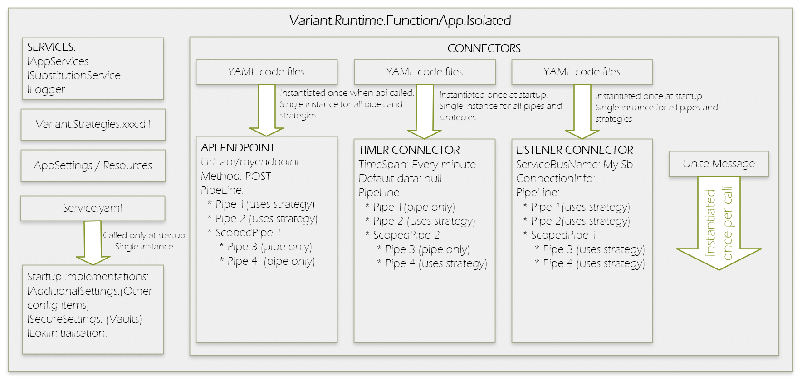

When the application start it follows the following startup sequence:

1. Logging is initialised
1. Core services are initialised
1. All strategies assemblies and code are loaded
1. Startup services (service.yaml) are initialised
1. Listener instances are initialised.
1. Connectors are started.

Only a single instance of each connectors, api endpoints and their pipeline are instantiated at startup. These are non-thread safe instances and should be used treated as such.

## Design Principals

Unite Server apps are built with an ‘Intent first, implementation second’ based method of building apps. An example of this would be a (very simplified) business requirement that allows a customer to send us information and store it for later use and then retrieve it somehow. The business hasn’t specified how we get the data in or where we store it. This is basically the intent of our solution: listen for data and then push it to a repository. How this is implemented will be mandated by solution architects. This separation of intent & implementation allows for a common set of intents to be extended by a plugable architecture on almost infinite implementations.

In UniteServer there are 2 specific ‘intent’ containers connectors and pipes and, depending on the intent type, the same implementation may be applied to both. A few examples of theses intents can be seen below. However before we discuss each we need to look at a Unite Message. Whenever a connector is triggered, be that a timer or anAPIi call etc , a Unite Message is created. This unite message then is passed into each pipeline or scoped pipeline where the message flow allows.

Another benefit of this is reuse and code specialisation. Connectors, pipes and strategies can be specialised and shared across multiple projects using extension packages. An example of this would be getting files from azure storage. Rather than creating this pipe and add the same settings each time we need this class we an create a specialised pipe that already contains say the account name, account key and directory. WHen created you name it accordingly and use that specialisation instead. SPecialisations can also be grouped into multiple pipes and scoped pipes for building robust pipes which abstract multiple pipes in a single pipe. This is gone into much more detail later on in this document.

## IUnite Message

IUniteMessage is the interface of the main message that is ubiquitous throughoutunite server applications. Everything that is to do with a single message is stored in a UniteMessage class as well as other properties for syncing and transactional  support across cloned messages. The interface is structured as below:

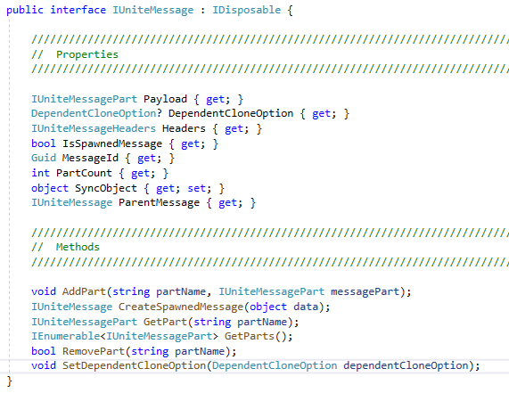

The three main areas of the messages are:

- Headers: These contain an enumeration of key-value pairs and enable routing, message splitting and contain any additional properties of the message.

- Payload: This is where the actual data of the message is stored. UniteMessage can actually handle multiple data items - called message parts - and Payload is the first one in the list.

- CreateSpawnedMessage() & IsSpawnedMessage: When a UniteMessage is created it may create other UniteMessages - PullMessages is a good example of this - and may need to enumerate them. Each additional message should be tied to its creator, for correlation purposes, and its this method and property which allows it.

## Specialisations (Derivatives)

The ability to specialise not only pipelines but connectors (using connections) is Unite Servers biggest advantage over any other development platforms, especially when these are placed in an extension package and shared across projects. Specifications are basically a reuse tool that allows developers to wrap up standardised functionality into a unified pipe where none specific settings can be overriden as and when required. Example implementations include the creation of standardised pipes for creating JWT tokens or validating these token or wrapping up functionality that requires multiple pipes. Each of these can be then wrapped in a simple pipe whose use is pretty much self explanatory.

Specialisation come in 3 forms:

- Pipe specialisations
- Process specialisations
- Process specialisations with implementation injection

We shall go through each of these in detail then go further into into the code stack, replacements, defaults and describe some of the pitfalls that may arise.

N.B. A lot of the more common types of specifics already exist in the runtime extensions. It is recommended the user takes a look at these.

### Pipe Specialisation

In each YAMl file there is a property called pipes and it is here we create the specialisations. If we take the above BlockBlobPushMessagePipe pipe we can create a derivative that can automatically set default values for us so, say we have many storage accounts each with their own account keys and names we can create a new pipe and set those values as the default values and name it accordingly as seen below:

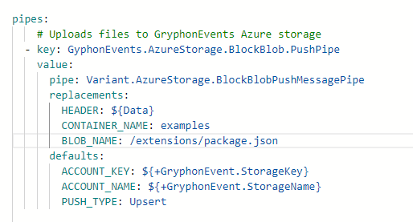

Then we could simple use this new pipe using the following

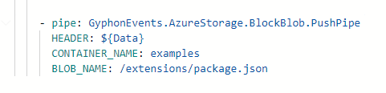

### Process Specialisations

Process specialisations are when multiple pipes are combined into a single callable pipe. If we take for an example we have to send an email with an attachment and all email requests have to be placed on a queue, we can't add the attachment to the queue due to the possibility it might be 2 big for the queue to fit. So what is needed is that we write the attachment to blob storage and put a reference link into the queues message. If we did this without any process or pipe specialisation the code would be something like:

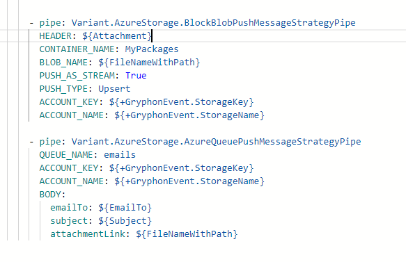

Would then be a single pipe:

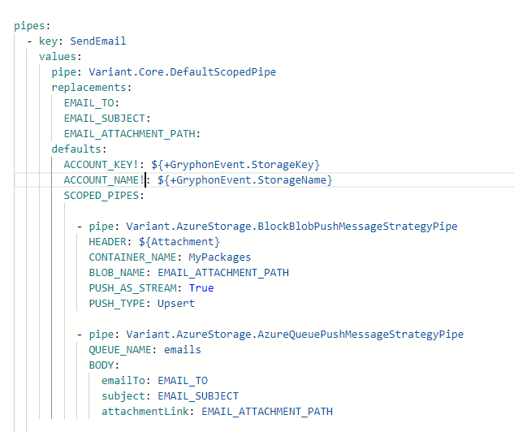

This pipe could then be added to a extension package so in future anyone that needs to send an email simple adds the extension to the project and then simply uses this:

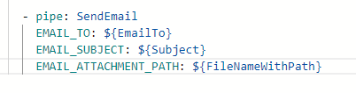

### Process Specialisations With Implementation Injection

As we can see from above we can inject specific values such as email and paths to a pipe. However, we can also inject both specification pipes and process specification pipes. Within a process specification. An example of this would be if we wanted to read a blob from azure storage, update it and then write the contents back to blob storage. There can be various types of documents that can be updated but the general process of fetching and storing the data remains the same. The example below shows an implementation of this and how its called:


To use the above see below:


In practise though you would be able to create another specification based on 'Variant.AzureStorage.BlockBlob.GetAndUpdateFileAsString' pipe above. This would allow the developer to sespecificic updates to specific storage accounts.

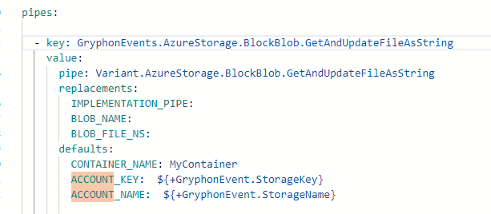

This then enables the user to call the pipe with the following pipe:


N.B. If the implementation pipe you are wanting to insert contains multiple pipes you can simply set your implementation pipe as a Variant.Core.DefaultScopedPipe and then add your implementations to its SCOPED_PIPES setting.

## Code stack, replacements, defaults and pitfalls

### Code stack

Before we discuss what replacements and defaults it helps if we explain how pipes are transformed into the actual code that is run. All pipes and strategies can be resolved to .Net code as seen below:

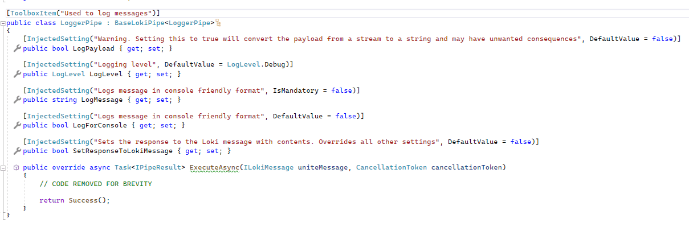

The assemblies that contain this code are then uploaded into the platform which takes these classes and produces the following YAML file:

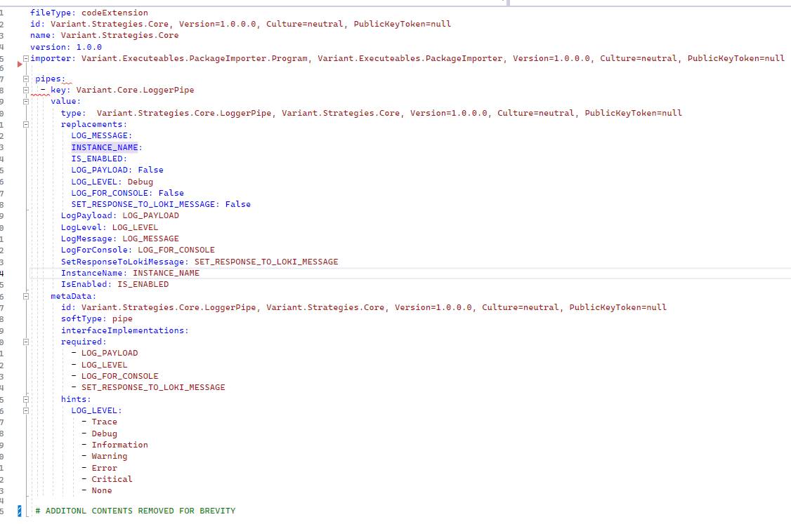

As seen previously we can then create several specialisations of this YAML to give us:
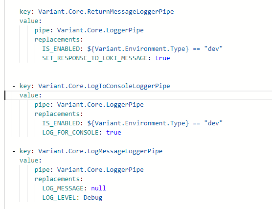

These specialisation, using the replacement and default values, is then used to instantiate the c# code with all the relevant values.

### Replacements & defaults

When create specialised pipes the settings can be done as replacements or defaults. The only difference between these values are that the replacements is that when the editor provides word completion options its only the replacement values that are outputted. If you then delete the replacement line the code will automatically set that properties default value to the default replacement value. Just because a setting is under the defaults property it doesn't mean that you cannot overrite it. Many settings that cannot be code completed are still settable. These include, but are not limited to the shared pipe settings: LOG_ERRORS, IS_ENABLED, EXECUTION_FLOW_STRATEGY, INSTANCE NAME etc.

### Pitfalls

As replacement values can override less specialised values in a pipe - a good example of this is the NAMESPACE property -care must be taken with common names across the different pipes used. This my result in unintended results. You can however ensure that a value will not be overridden by adding an exclamation mark at the end of the setting name. An example of this seen below:

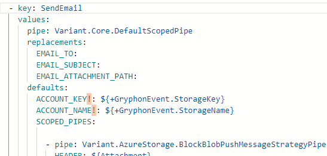

By adding these to the end of the ACCOUNT_NAME & ACCOUNT_KEY we can be sure that even if a pipe 'above' this pipe uses theses properties that the properties here will not override as the per the default intended use.
