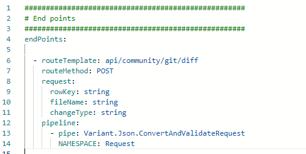
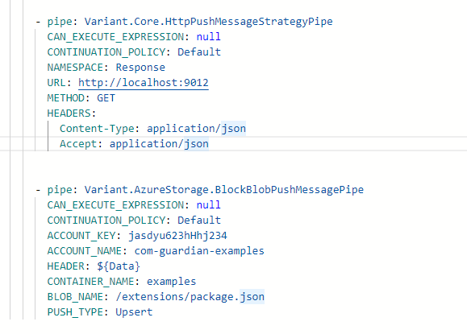

# The anatomy of a Unite Server application 

Unite server is development platform which basically converts a set of YAML files, resource files and .NET core code into into a working Function App or containerised app.  It is the aim of this document to give a brief overview of each of the constituent parts, data structures and message flows.

A Unite Server Application is a modified Microsoft .Net core application. This application, rather than being built from a standard set of, say C# files, is built by combining different types of text and assembly files into a single zip file that can be run as either an Azure Function App or containerised app.

The files that make up a Unite Server App are: 

* The Variant runtime. 
* Extension packages:  
* Configuration files
* YAML code files
* Reference files

When an application is deployed or a release created, the Unite development platform combines each of these files into a single deployable .NET Core runtime zip file. 

### The Runtime

The runtime is a versionable set of core files which each application is deployed with to create a runnable application.  Unite currently offers 2 different runtimes that an application can hosted in: An Azure Function App or a containerised app. Each of these 'hosting' options provide the following features:

* Http endpoint capabilities
* Background hosting services
* Logging & instrumentation
* Configuration and substitution management
* Inline code compilation
* Base connectors and pipes classes for building additional assembly based extension packages.

### Extension packages

Extension Packages are discreet library components that are imported into an application to add different types of functionality to the core runtime. This functionality can include:
* A prebuilt set of YAMLised connectors, pipes & strategies that can be configured directly in the application. Examples of these include libraries for Azure Management, Libraries that connect directly.
* The ability to extend the platform through new .NET Core code. This code, based from classes found in the Unite framework assemblies,  would be uploaded to the platform and the platform would create the necessary YAML metadata files to allow the functionality to be called the YAML code files directly.
* New substitution methods that are run in the substitution service.
* The ability to quickly share code snippets between projects promoting the reuse of code artifacts at any granular level.

### Configuration files

There are 4 different configuration files used in a Unite service:

* **appsetings.json**: As it's name sugguests, this is a configuration file and of the same format and schema as a standard .Net core settings file.
* **local.settings.json**: This is a settings file which is only used when developing the application. It is not included in any release zip file.
* **site-config.json**:  this is a project file and keeps track of any extension packages added as well as other deployment information. in general, you should not need to edit this file manually. 
* **service.yaml**: This file contains the configuration of any startup services the application needs. These include, but are not limited to: any external application settings configuration stores that are needed, as well as Uniite development services that are required for the development environment. 

### YAML code files

Unite applications work on the idea of a message that is processed through a series of pipes i.e. a pipeline. That message is created by a certain event or timer and that message then flows down the pipes being processed and updated by each pipe as and when required.  Unite determines where these messages come from and configured through 4 different types of objects:
* Connectors
* Endpoints
* Pipes
* Strategies

#### Connectors

An application can contain multiple inbound connectors. and these fall into 2 categories:

- **Listeners**: Waits for to external systems to contact it. Implementation examples include: an HTTP endpoints,, Service bus listeners an endpoint connected to Twitter or a web sockets.
- **Timers**: Interval or schedule timers can be connected to intents that pull a single message or multiple messages and then process those items or just fire off an instruction to start off another type of process. Example of these include reading a database for a list of users to perform some action on each or polling a queue for messages

Below are examples of 2 connectors that are found in the default service StartUp page.

The **AzureFunctionIsolatedConnector** is the primary API endpoint connector for managing API calls using functionsApps. All API calls go through this connector and are routed on the their specific API endpoint.

The second **KeepAliveConnector** is a function app only connector and is used to stop any function apps hosted in a consumption plan from shutting down

#### Endpoints

Endpoints are routed HTTP connections. That the runtime calls via the AzureFunctionIsolatedConnector , when it's an Azure Function App or the API KestrelConnector when creating containerized apps. These lisiteners are configured differently to normal connectors but they have the same pipeline property that works the same as the connectors pipeline:

An endpoint can also describe the request, queries, headers and response properties as seen above. These allow for both the OpenApi specification to be generated adn inputs validated. An example of this is seen below:

#### Pipes and strategies

Pipes are placed in a pipeline and perform actions based on their intent. In the core framework there are multiple intent pipes each with multiple strategies (implementations). Examples of the types of intents are:

- PushMessage: Pushes data to somewhere. Strategies include: HTTP call, file writer, databases upserts, Azure storage, etc.

- PullMessagesPipe: pulls a list of messages from a somewhere. Strategies available include :database, file directory, Azure Storage etc.

- ForEachMessagePipe: This uses PullMessage implementations and allows the iteration of messages pulled from the specified strategies.

- PullSingleMessagePipe: As above but only deals with a single message

- ModifyMessagePipe: This can be used to update the UniteMessage. Examples include encryption and decryption, compression, converting a message to and from a JSON string, adding new values values.
- 
- AggregatePipe: Helpful when aggregating data. Examples include: StringBuilderAggregate, JArrayAggregate.

If we look at 2 examples of the PushMessagePipe we see that the implementation is denoted in the strategy property:

This notation can be a bit long winded so when strategies are imported from .NET assemblies the importer creates a specialised version of each strategy that includes the the strategy name in the pipe. This allows the developer to use this simplified version and reduce the number of lines of code. Examples of the are:

The above pipes also include default values. If we are ok with the default values then we can remove them so the code would now look like:

N.B. The actual pipes and strategies have many more default values however, for brevity, these have been removed.

The above examples where each pipe name contains the strategy name are examples of specialisations. Specialisations are critical when developing applications and provide a multitude of benefits.

## Overview and start up sequence

When ever you deploy or publish an your application the development environment creates a zip file dependent on your choice of application output (either an Azure Function App or container app). This zip contains:

- **Variant runtime assemblies**: Contains core functionality, interfaces and implementations and Unite Message definitition.
- **Strategy assemblies**: These are .Net Core assemblies (extension assemblies) which specific technological strategy pipe, connector and strategy implementations. e.g. Azure Storage, XmL, compression, etc.
- **Service.yaml**: This contains the process startup and settings services.
- **Site-config.json**: This contains the services shared properties (primary used during development and deployment) but can be accessed during runtime.
- **Yaml files**: Code implementations of services and endpoints.

This can be seen in the diagram below:

When the application start it follows the following startup sequence:

1. Logging is initialised
1. Core services are initialised
1. All strategies assemblies and code are loaded
1. Startup services (service.yaml) are initialised
1. Listener instances are initialised.
1. Connectors are started.

Only a single instance of each connectors, api endpoints and their pipeline are instantiated at startup. These are non-thread safe instances and should be used treated as such.

## IUnite Message

IUniteMessage is the interface of the main message that is ubiquitous throughoutunite server applications. Everything that is to do with a single message is stored in a UniteMessage class as well as other properties for syncing and transactional  support across cloned messages. The interface is structured as below:

The three main areas of the messages are:

- Headers: These contain an enumeration of key-value pairs and enable routing, message splitting and contain any additional properties of the message.

- Payload: This is where the actual data of the message is stored. UniteMessage can actually handle multiple data items - called message parts - and Payload is the first one in the list.

- CreateSpawnedMessage() & IsSpawnedMessage: When a UniteMessage is created it may create other UniteMessages - PullMessages is a good example of this - and may need to enumerate them. Each additional message should be tied to its creator, for correlation purposes, and its this method and property which allows it.

[specialisations-and-derivatives](specialisations-and-derivatives.md)