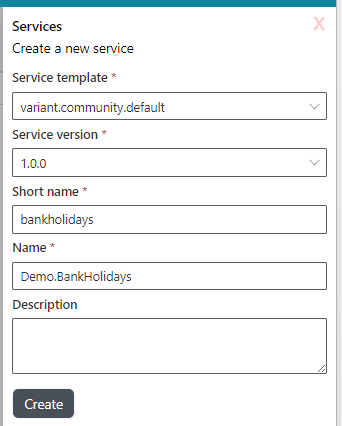
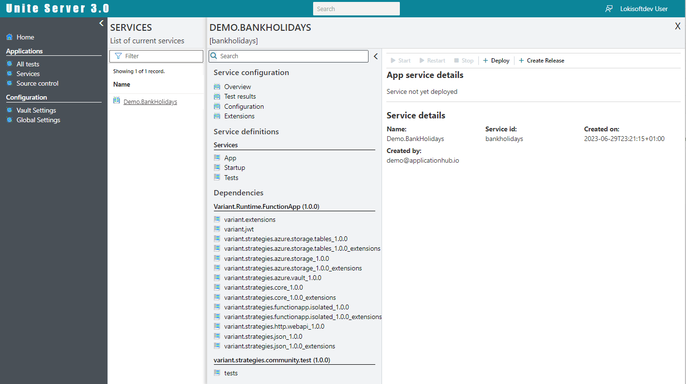
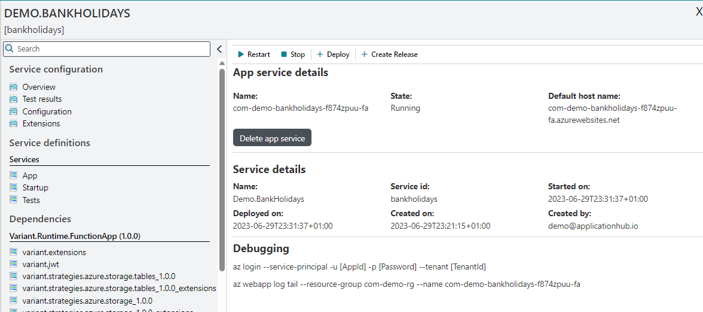
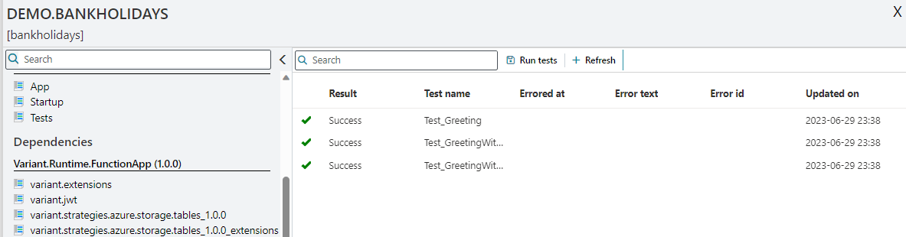
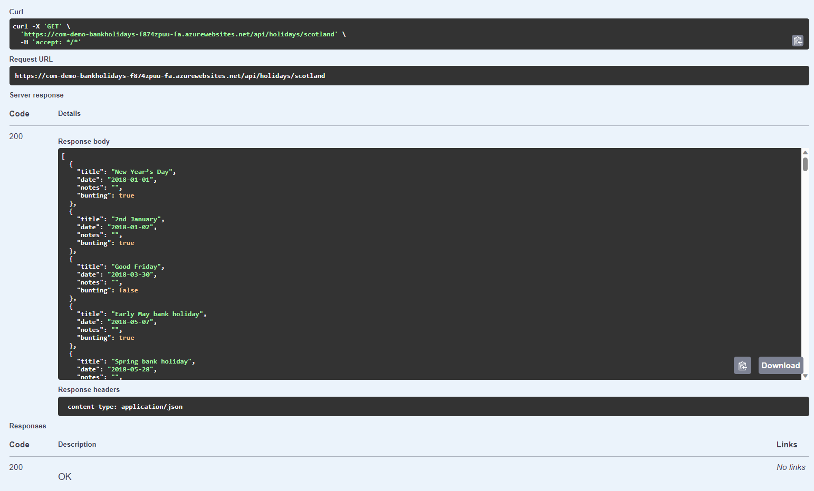

# Building a Unite API application from start to finish

In this example we'll for through the steps of creating a simple bank holiday service that returns future bank holiday dates for England & Wales, Scotland & Northern Ireland.

This will be done in 4 parts where we first create a blank service and deploy it and then add more functionality with each further steps.

- [Building a Unite API application from start to finish](#building-a-unite-api-application-from-start-to-finish)
  - [Step 1: Creating and deploying a templated Unite (Function App) into Azure](#step-1-creating-and-deploying-a-templated-unite-function-app-into-azure)
  - [Step 2: Calling an external Http endpoint](#step-2-calling-an-external-http-endpoint)
  - [Step 3: Returning regional dates only with caching and retries](#step-3-returning-regional-dates-only-with-caching-and-retries)
  - [Step 4: Adding the option to return the dates as CSV](#step-4-adding-the-option-to-return-the-dates-as-csv)
  - [Step 4: Adding the option to return the dates as CSV](## step-4-adding-the-option-to-return-the-dates-as-csv)

## Step 1: Creating and deploying a templated Unite (Function App) into Azure

1. Go to the services page a click 'Create new service'.
1. Fill in the form as below and click Ok. The short name is used in conjunction with the subscription name to define what the service URL will be named as. This name will be prefixed with 12 character random string to provide the full name as will be seen later.



Click on the name and you should see the service page as below:



Now click on the 'deploy' button at the top of the page. Once deployed you should see the App service details on the page



Now click on the test results menu and then click on the 'Run tests' button. ait a few seconds and then click on the refresh button and you should see the following results:



You have now successfully created and deployed you application.

> Note You can also run your application using Postman. Go to the overview page and get the default host name. use the 'https' protocol and use api/test as the path. Look at the 'App' file for the default endpoints available.

## Step 2: Calling an external Http endpoint

To get the bank holiday dates for the UK we'll fetch these from the Government bank holidays API found at: **https://www.gov.uk/bank-holidays.json**

To do this all we need to do is update the the 'Apps' file to:

```yaml
endPoints:
  - routeTemplate: api/holidays
    routeMethod: GET
    description: Gets England & Wales bank holidays
    pipeline:
      - pipe: Variant.Core.Http.PushPipe
        # Setting NAMESPACE to Response will automatically return that data as your HTTP response
        NAMESPACE: Response
        URL: https://www.gov.uk/bank-holidays.json
        HEADERS: { Accept: application/json }
        JSON_PARSE_PATH: .
        METHOD: GET
```

Save the file and then call the API using Postman. and you should get something like this (some items have been removed for brevity):

> NOTE: You do not need to deploy the application again in this instance as the framework uses continuous integration to update the code. You will have to redeploy when extensions have been added or restart the application when configuration settings have changed.

```json
{
  "england-and-wales": {
    "division": "england-and-wales",
    "events": [
      {
        "title": "New Year’s Day",
        "date": "2018-01-01",
        "notes": "",
        "bunting": true
      },
      {
        "title": "Good Friday",
        "date": "2018-03-30",
        "notes": "",
        "bunting": false
      }
    ]
  },
  "scotland": {
    "division": "scotland",
    "events": [
      {
        "title": "New Year’s Day",
        "date": "2018-01-01",
        "notes": "",
        "bunting": true
      }
    ]
  },
  "northern-ireland": {
    "division": "northern-ireland",
    "events": [
      {
        "title": "New Year’s Day",
        "date": "2018-01-01",
        "notes": "",
        "bunting": true
      }
    ]
  }
}
```

This however, is no different to calling the original bank holiday service directly. For the service to be useful we could return the data in a shape that is more suitable to our own needs. This could include:

- Only return specific regional data
- Return formated regional data ie. CSV.

in the next steps we'll shall to that.

## Step 3: Returning regional dates only with caching and retries

To return region only data we could add multiple endpoints or we could have a single endpoint like '../api/holidays/{region}. Both are valid options but for this example we'll use 3 endpoints and a common pipe as using the single endpoint option would require addition validation of the actual region in the url. So to create 3 separate endpoints we need to update the 'App' to match the following YAML:

```yaml
endPoints:
  - routeTemplate: api/holidays/england-and-wales
    routeMethod: GET
    description: Gets England & Wales bank holidays
    pipeline:
      - pipe: GetRegionalBankHolidays
        REGION: england-and-wales

  - routeTemplate: api/holidays/scotland
    routeMethod: GET
    description: Gets Scotland bank holidays
    pipeline:
      - pipe: GetRegionalBankHolidays
        REGION: scotland

  - routeTemplate: api/holidays/northern-ireland
    routeMethod: GET
    description: Gets Northern Ireland bank holidays
    pipeline:
      - pipe: GetRegionalBankHolidays
        REGION: northern-ireland

pipes:
  - key: GetRegionalBankHolidays
    value:
      pipe: Variant.Core.DefaultScopedPipe
      replacements:
        REGION:
      defaults:
        SCOPED_PIPES:
          - pipe: Variant.Core.Http.PushPipe
            NAMESPACE: Response
            URL: https://www.gov.uk/bank-holidays.json
            HEADERS: { Accept: application/json }
            JSON_PARSE_PATH: REGION.events
            METHOD: GET
            # Caches the response for 30 minutes
            CACHE_STRATEGY:
              strategy: Variant.Core.SimpleCacheStrategy
              CACHE_FOR_TIME_SPAN: 00:30:00
            # Retry if there's transient errors
            RETRY_POLICY:
              strategy: Variant.Core.DefaultRetryStrategy
              RETRY_COUNT: 3
              SLEEP_DURATION: 300
              DURATION_MULTIPLIER: 1.5
```

As you can see we have 3 specific endpoints that each call a shared pipe 'GetRegionalBankHolidays' that returns the correct data depending on what specific region is passed in. To stop unnecessary calls and mitigate against any transient error we've also added cache and retry policies to the external bank holiday service call.

When we call one of these endpoints using a swagger editor we get the following results returned:



## Step 4: Adding the option to return the dates as CSV

To return the data as a string with dates separated by certain text we need to to update the GetRegionalBankHolidays pipe. As seen below we've changed the pipe to first accept a separator value and then either create the string if the separator is not null or simply return the JSON .

```yaml
- key: GetRegionalBankHolidays
  value:
    pipe: Variant.Core.DefaultScopedPipe
    replacements:
      SEPARATOR:
      REGION:
    defaults:
      SCOPED_PIPES:
        - pipe: Variant.Core.Http.PushPipe
          # Removed for brevity

          # If the separator is not found then exit pipe
        - pipe: Variant.Core.BreakPipe
          CAN_EXECUTE_EXPRESSION: SEPARATOR == null

          # We take the JSON response from the Http call, extract the dates and then
          # we use the Join method to convert the array to a x separated string
        - pipe: Variant.Core.SetResponseWithHeaders
          RESPONSE: ${Response.SelectTokens("$..date").Join("SEPARATOR")}
          HEADERS: { Content-Type: text/plain }
```

Now we have a method that can return a single separated string we need to somehow pass that separator into it. We can do this vai a query parameter on the API call. Below is the updated endpoint which performs this:

```yaml
- routeTemplate: api/holidays/england-and-wales
  routeMethod: GET
  description: Gets England & Wales bank holidays
  # This is added for OpenApi / swagger
  queryParameters:
    separator?: string
  pipeline:
    - pipe: GetRegionalBankHolidays
      # We get the separator from the query string parameters
      SEPARATOR: ${?Request.Query.separator}
      REGION: england-and-wales
```

id we call the service using the url: '../api/holidays/england-and-wales?separator=|' we should get the following output:

```json
2018-01-01|2018-03-30|2018-04-02|2018-05-07|2018-05-28|2018-08-27|2018-12-25|2018-12-26|2019-01-01|2019-04-19|..{rest removed for brevity}
```

The complete 'Apps' file now looks this:

```yaml
endPoints:

- routeTemplate: api/holidays/england-and-wales
    routeMethod: GET
    description: Gets England & Wales bank holidays
    queryParameters:
      separator?: string
    pipeline:
      - pipe: GetRegionalBankHolidays
        REGION: england-and-wales
        SEPARATOR: ${?Request.Query.separator}

  - routeTemplate: api/holidays/scotland
    routeMethod: GET
    description: Gets Scotland bank holidays
    queryParameters:
      separator?: string
    pipeline:
      - pipe: GetRegionalBankHolidays
        REGION: scotland
        SEPARATOR: ${?Request.Query.separator}

  - routeTemplate: api/holidays/northern-ireland
    routeMethod: GET
    description: Gets Northern Ireland bank holidays
    queryParameters:
      separator?: string
    pipeline:
      - pipe: GetRegionalBankHolidays
        REGION: northern-ireland
        SEPARATOR: ${?Request.Query.separator}

pipes:
  - key: GetRegionalBankHolidays
    value:
      pipe: Variant.Core.DefaultScopedPipe
      replacements:
        REGION:
        SEPARATOR:
      defaults:
        SCOPED_PIPES:
          - pipe: Variant.Core.Http.PushPipe
            NAMESPACE: Response
            URL: https://www.gov.uk/bank-holidays.json
            HEADERS: { Accept: application/json }
            JSON_PARSE_PATH: REGION.events
            METHOD: GET
            # Caches the response for 30 minutes
            CACHE_STRATEGY:
                strategy: Variant.Core.SimpleCacheStrategy
                CACHE_FOR_TIME_SPAN: 00:30:00
            # Retry if there's transient errors
            RETRY_POLICY:
                strategy: Variant.Core.DefaultRetryStrategy
                RETRY_COUNT: 3
                SLEEP_DURATION: 300
                DURATION_MULTIPLIER: 1.5

            # If the separator is not dound then exit pipe
          - pipe: Variant.Core.BreakPipe
            CAN_EXECUTE_EXPRESSION: SEPARATOR == null

            # We take the response from the Http call, extract just the dates and then
            # we use the Join method to convert the array to a x separated string
          - pipe: Variant.Core.SetResponseWithHeaders
            RESPONSE: ${Response.SelectTokens("$..date").Join("SEPARATOR")}
            HEADERS:  { Content-Type: text/plain }
```
